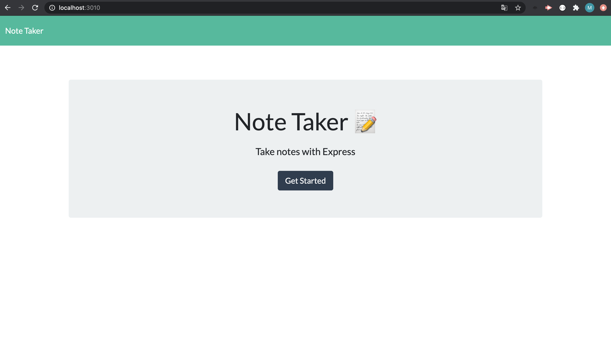
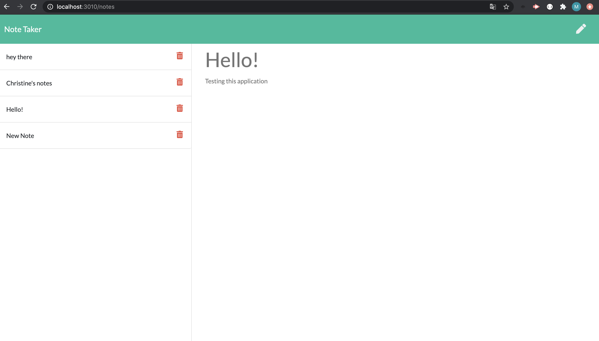
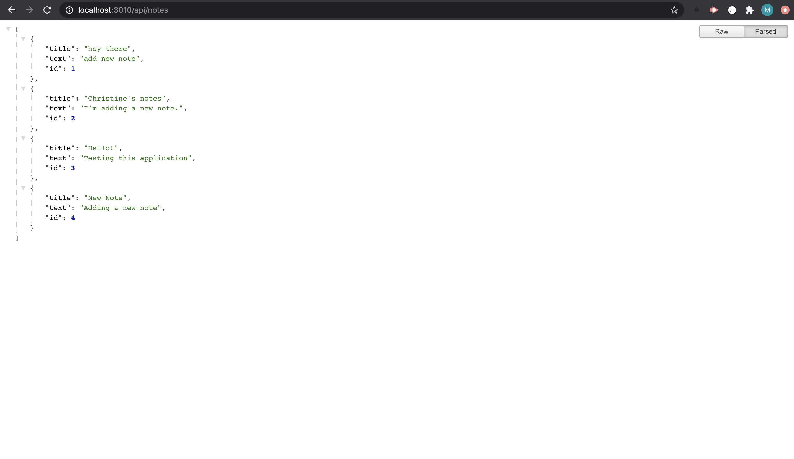

[](https://github.com/xtineroq?tab=followers)

# Note Taker

## Description
➤ This application can be used to write, save, and delete notes. It uses an express backend to save and retrieve note data from a JSON file.

## Table of Contents
* [Installation](#installation)
* [Usage](#usage)
* [License](#license)
* [Contributing](#contributing)
* [Tests](#tests)
* [Questions](#questions)
* [Screenshots](#screenshots)
* [Deployed Application](#deployed-application)

## Installation
```
Please run npm install to install all dependencies and then run npm start to start the application.
```

## Usage
➤ This can be used to write and save new notes, as well as, view and delete existing notes.

## License
This app is covered under the following license/s:


## Contributing
➤ Please contact the author for more information.

## Tests
```
none
```

## Questions
Please direct all questions to:

👤 https://github.com/xtineroq

📧 mcroque89@gmail.com

## Screenshots




## Deployed Application

View this on Heroku:
https://mysterious-wildwood-12652.herokuapp.com/